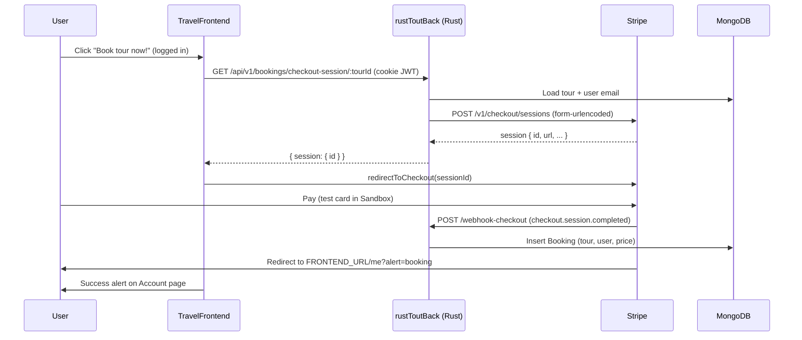

# Stripe payments — setup, env vars, and local dev

This document describes how Stripe Checkout is integrated in this repo: **TravelFrontend** (React) + **rustToutBack** (Rust API). The flow mirrors the original **TravelAndTour** (Express) TravelAndTour booking pattern.

---

## 1. Stripe credentials (test mode)

All local development uses **test mode**. No real charges are made.

### 1.1 Create or sign in to Stripe

1. Go to [https://dashboard.stripe.com](https://dashboard.stripe.com) and create an account (or sign in).
2. Ensure **Test mode** is on (toggle in the Dashboard header). Keys and Checkout will show a **Sandbox** badge.

### 1.2 API keys (publishable + secret)

1. Open **Developers → API keys** ([direct link](https://dashboard.stripe.com/test/apikeys)).
2. Copy:
   - **Publishable key** — starts with `pk_test_...` → frontend
   - **Secret key** — starts with `sk_test_...` → backend only (never commit or expose in the browser)

Reveal the secret key once and store it in your password manager or local `.env` only.

### 1.3 Webhook signing secret (local)

Stripe must notify your server when checkout completes. On localhost you use the **Stripe CLI** to forward events; the CLI gives you a **webhook signing secret** (`whsec_...`).

1. Install the CLI (macOS):

   ```bash
   brew install stripe/stripe-cli/stripe
   ```

2. Log in (one-time):

   ```bash
   stripe login
   ```

3. When developing, run the listener (see [§4](#4-run-locally-future-sessions)):

   ```bash
   stripe listen --forward-to localhost:3000/webhook-checkout
   ```

4. Copy the **`whsec_...`** line printed at startup into `rustToutBack/.env` as `STRIPE_WEBHOOK_SECRET`.

> **Production:** You would register a fixed HTTPS URL in **Developers → Webhooks** in the Dashboard and use that endpoint’s signing secret instead of the CLI secret.

---

## 2. Environment variables

### 2.1 Backend — `rustToutBack/.env`

Copy from `rustToutBack/.env.example` if needed, then set:

| Variable | Example | Purpose |
|----------|---------|---------|
| `STRIPE_SECRET_KEY` | `sk_test_...` | Server calls Stripe API to create Checkout sessions |
| `STRIPE_WEBHOOK_SECRET` | `whsec_...` | Verifies `Stripe-Signature` on `POST /webhook-checkout` |
| `FRONTEND_URL` | `https://localhost:5173` | Success/cancel URLs and product image URL sent to Stripe |

Also keep your usual DB/JWT vars (`DATABASE` or `DATABASE_LOCAL`, `JWT_SECRET`, etc.).

```env
STRIPE_SECRET_KEY=sk_test_your_secret_key
STRIPE_WEBHOOK_SECRET=whsec_from_stripe_listen
FRONTEND_URL=https://localhost:5173
```

Restart the Rust API after changing these values.

### 2.2 Frontend — `TravelFrontend/.env`

Copy from `TravelFrontend/.env.example`:

| Variable | Example | Purpose |
|----------|---------|---------|
| `VITE_API_URL` | `http://localhost:3000/api/v1` | Rust API base URL |
| `VITE_STRIPE_PUBLISHABLE_KEY` | `pk_test_...` | Loads Stripe.js and `redirectToCheckout` |
| `VITE_MAPBOX_TOKEN` | `pk....` | Tour map (unrelated to payments) |

```env
VITE_API_URL=http://localhost:3000/api/v1
VITE_STRIPE_PUBLISHABLE_KEY=pk_test_your_publishable_key
VITE_MAPBOX_TOKEN=your_mapbox_token
```

Restart the Vite dev server after editing `.env`.

### 2.3 Security notes

- Never commit real `.env` files (use `.env.example` as templates).
- Use **test** keys (`pk_test_`, `sk_test_`) locally.
- `sk_test_` and `whsec_` must stay on the server / in `rustToutBack` only.

---

## 3. Payment flow in the application



### Step-by-step

1. **User must be logged in**  
   On a tour page (`/tour/:slug`), **Book tour now!** redirects to `/login` if there is no session.

2. **Create Checkout session (protected API)**  
   - Route: `GET /api/v1/bookings/checkout-session/:tourId`  
   - Auth: JWT in HTTP-only cookie (same as other protected routes).  
   - Handler: `rustToutBack/src/handlers/bookings.rs` → `get_checkout_session`  
   - Service: `rustToutBack/src/services/stripe.rs` → `create_checkout_session`  
   - Stripe receives: mode `payment`, line item from tour price/name/summary, `customer_email`, `client_reference_id` = tour MongoDB id, success URL `{FRONTEND_URL}/me?alert=booking`, cancel URL `{FRONTEND_URL}/tour/{slug}`.

3. **Browser redirect to Stripe**  
   - `TravelFrontend/src/api/bookings.ts` loads Stripe.js with `VITE_STRIPE_PUBLISHABLE_KEY`, then calls `stripe.redirectToCheckout({ sessionId })`.

4. **Customer pays on Stripe Hosted Checkout**  
   - Sandbox UI; use test cards only (see below).

5. **Webhook creates the booking**  
   - Stripe sends `POST http://localhost:3000/webhook-checkout` with raw body and `Stripe-Signature`.  
   - This route is mounted **before** JSON body middleware so the signature can be verified on raw bytes (`rustToutBack/src/main.rs`).  
   - On event type `checkout.session.completed`, the server reads `client_reference_id` (tour id), `customer_email`, and `amount_total`, finds the user, and inserts a document into the `bookings` collection.

6. **Success redirect**  
   - User lands on `/me?alert=booking`.  
   - `TravelFrontend/src/pages/Account.tsx` shows a success alert and clears the query param.

### Key source files

| Layer | File |
|-------|------|
| Frontend checkout call | `TravelFrontend/src/api/bookings.ts` |
| Tour page button | `TravelFrontend/src/pages/TourDetail.tsx` |
| Success UI | `TravelFrontend/src/pages/Account.tsx` |
| Checkout + webhook handlers | `rustToutBack/src/handlers/bookings.rs` |
| Stripe HTTP + signature verify | `rustToutBack/src/services/stripe.rs` |
| Routes | `rustToutBack/src/routes/booking_routes.rs`, `rustToutBack/src/main.rs` |

### Test card (no real payment)

On Stripe Checkout (Sandbox):

| Field | Value |
|-------|--------|
| Card number | `4242 4242 4242 4242` |
| Expiry | Any future date (e.g. `12/34`) |
| CVC | Any 3 digits (e.g. `123`) |
| Card declined number| 4000 0000 0000 0002 |
| Requires 3D Secure | 4000 0025 0000 3155 |

More scenarios: [Stripe testing docs](https://docs.stripe.com/testing#cards).

**Important:** Payment can succeed in Stripe’s UI but **no booking is saved** unless the webhook runs and returns `200`. Always run `stripe listen` locally with the matching `STRIPE_WEBHOOK_SECRET`.

---

## 4. Run locally (future sessions)

Use **three terminals**. Order: API and frontend can start anytime; start `stripe listen` before you complete a test payment (or restart the API after pasting a new `whsec_`).

### Terminal 1 — Rust API (port 3000)

```bash
cd rustToutBack
cargo run
```

Requires MongoDB reachable via `DATABASE` / `DATABASE_LOCAL` in `rustToutBack/.env`.

### Terminal 2 — React frontend (port 5173)

```bash
cd TravelFrontend
nvm use 24   # or Node 20.19+ — Vite requires modern Node
npm install  # first time only
npm run dev
```

Open [https://localhost:5173](https://localhost:5173).

### Terminal 3 — Stripe webhook forwarder

```bash
stripe listen --forward-to localhost:3000/webhook-checkout
```

1. Copy the displayed **`whsec_...`** into `rustToutBack/.env` → `STRIPE_WEBHOOK_SECRET`.
2. **Restart** Terminal 1 (`cargo run`) if you changed the secret.

### Quick test checklist

- [ ] Logged in on the frontend  
- [ ] `STRIPE_SECRET_KEY`, `STRIPE_WEBHOOK_SECRET`, `FRONTEND_URL` set in `rustToutBack/.env`  
- [ ] `VITE_STRIPE_PUBLISHABLE_KEY` and `VITE_API_URL` set in `TravelFrontend/.env`  
- [ ] `stripe listen` running; API restarted after updating webhook secret  
- [ ] Pay with `4242 4242 4242 4242`  
- [ ] Redirect to `/me?alert=booking` and booking row in MongoDB `bookings` collection  

### Common issues

| Symptom | Likely cause |
|---------|----------------|
| 500 on checkout-session | Missing/invalid `STRIPE_SECRET_KEY`, or Stripe API error (check API logs) |
| “Booking successful” alert but **no row in `bookings`** | Webhook failed. The success message only means Stripe redirected to `success_url`; the booking is created in `POST /webhook-checkout` on `checkout.session.completed`. |
| All webhooks return **400** in API logs | Wrong `STRIPE_WEBHOOK_SECRET` (must be `whsec_...` from `stripe listen`, not a CLI pairing phrase), or API not restarted after updating it |
| `charge.succeeded` / `payment_intent.*` return 400 | Same as above — only `checkout.session.completed` creates a booking; other events should return **200** once the secret is correct |
| CORS / cookie errors | Frontend must use `https://localhost:5173` and API `http://localhost:3000`; requests use `withCredentials` |
| Stripe.js `SecurityError` / `document` in console | Harmless cross-origin iframe noise from `js.stripe.com` after checkout; ignore if payment and webhooks work |
| Stripe.js error in browser | Missing `VITE_STRIPE_PUBLISHABLE_KEY` or not restarted Vite after `.env` change |

---

## Reference: original TravelAndTour

The Express app used the same ideas: protected `GET /api/v1/bookings/checkout-session/:tourId`, Stripe Checkout redirect in `public/js/index.js`, and `POST /webhook-checkout` before `express.json()`. This Rust + React stack preserves that behavior with env-driven `FRONTEND_URL` and form-encoded Stripe session creation.
